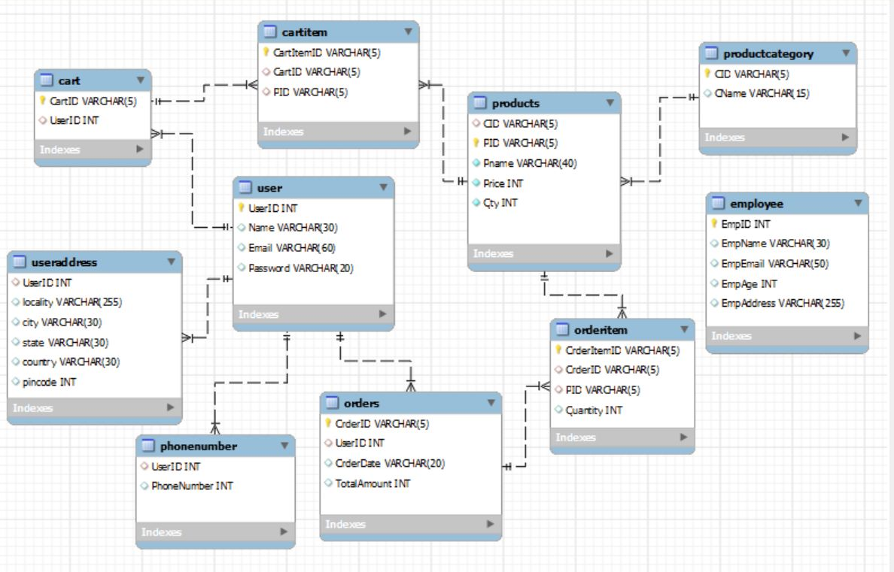
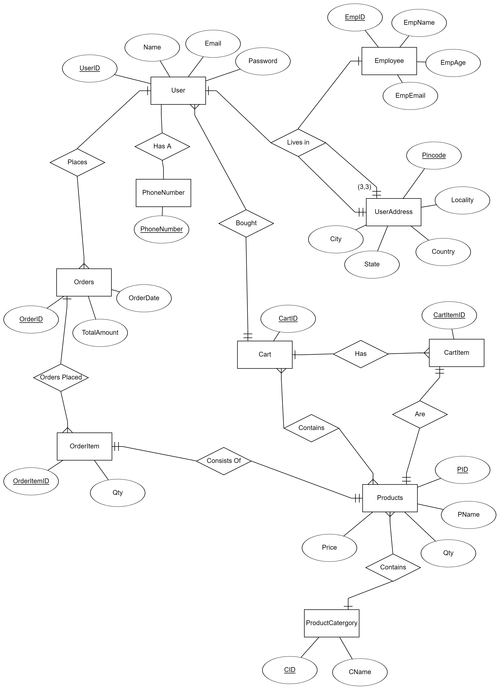

# E-Commerce Management API

A sample shopping API built with **Express.js** for learning purposes. This API provides CRUD operations for managing products and customers in a MySQL database. The API follows REST principles and uses **Swagger** for API documentation.



### The ER diagram for the database is shown below:


## Features

- Retrieve a list of all products and customers.
- Get details of a specific product by its ID.
- Add, update, and delete products.
- Add new customers to the database.
- MySQL integration using **mysql2** package for database operations.
- Swagger API documentation for clear interaction and understanding of the API.

---


## Prerequisites

Before running this project, ensure you have the following installed:

- [Node.js](https://nodejs.org/)
- [MySQL](https://www.mysql.com/)

---

## Getting Started

### 1. Clone the Repository

```bash
git clone https://github.com/Prayag2003/e-commerce-dbms-project.git
cd e-commerce-dbms-project
```

### 2. Install Dependencies
```
cd server/
npm install
```

### 3. Setup Database
Make sure you have a MySQL server running.
Create a new MySQL database for this project.
In the server/database.js file, configure your MySQL connection settings (username, password, database name, etc.).

### 4. Start the Server
Run the following command in the server/ folder to start your Express.js server:

## API Endpoints

Below are some key API endpoints for the shopping API:

### Products

- **GET** `/api/v1/products`: Retrieve all products.
- **GET** `/api/v1/product/{PID}`: Retrieve a product by its ID.
- **POST** `/api/v1/addProduct`: Add a new product.
- **PATCH** `/api/v1/updateProduct/{PID}`: Update a product by its ID.
- **DELETE** `/api/v1/deleteProduct/{PID}`: Delete a product by its ID.

### Customers

- **GET** `/api/v1/getCustomers`: Retrieve all customers.
- **POST** `/api/v1/addCustomer`: Add a new customer.

## Database Configuration

Ensure your MySQL database is properly configured in `server/database.js`. You can use SQL scripts in the `database/tables/` folder to create the necessary tables for products and customers.

## Technologies Used

- **Express.js**: Web framework for Node.js.
- **MySQL2**: MySQL client for Node.js, used for database operations.
- **Swagger**: API documentation.
- **Node.js**: Server-side JavaScript runtime.
